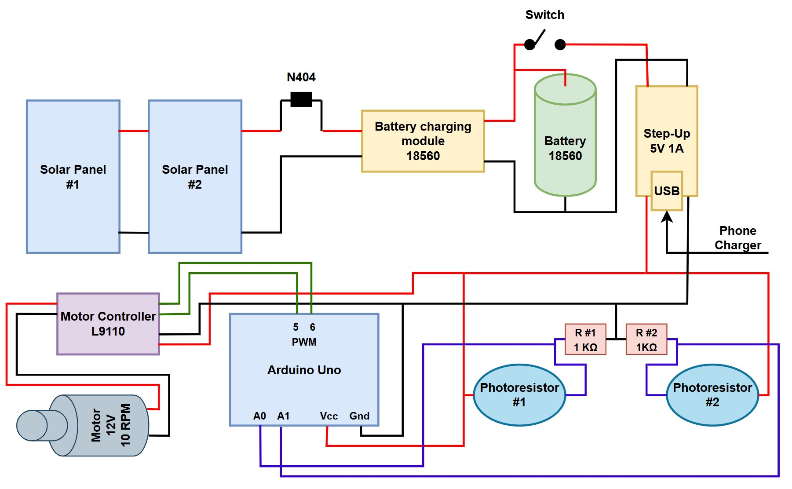

# Solar-Powered Phone Charger with Dual-Axis Light Tracking  

An Arduino-controlled solar charging system that automatically aligns two solar panels toward the strongest light source using photoresistors, a motor driver, and a tracking algorithm

The project combines **renewable power generation**, **battery management**, and **automatic solar tracking** to maximize energy capture and provide a stable **5V USB output** for phone charging

### Components  
- 2× Solar Panels (6V, 160mA, 0.96W each)
- 18560 Lithium Battery  
- 18560 Battery Charging Module  
- 5V 1A Step-Up Converter (USB output)  
- Arduino Uno  
- L9110 Motor Controller  
- 12V 10 RPM Motor  
- 2× Photoresistors (5528 LDR)
- 2× 1kΩ resistors  
- N4004 diode (1N4004-T)  
- Power switch  
- Wiring, connectors, mounting hardware  

---

## How the Solar Tracking Works  
To improve charging efficiency, the system continuously adjusts the orientation of the solar panels based on real-time light intensity measurements

Two photoresistors measure light on the **left** and **right** sides of the panel assembly. The Arduino compares these values and rotates the motor toward the brighter side.

This creates an automatic, proportional light-seeking mechanism.
